# Workout Logger — diagrams

Structural and behavioural diagrams (Mermaid, renders on GitHub). See `DESIGN.md` for the authoritative
architecture record and `CLAUDE.md` for invariants. Diagrams reflect the current code.

---

## Structural

### 1. System architecture (components & runtime)

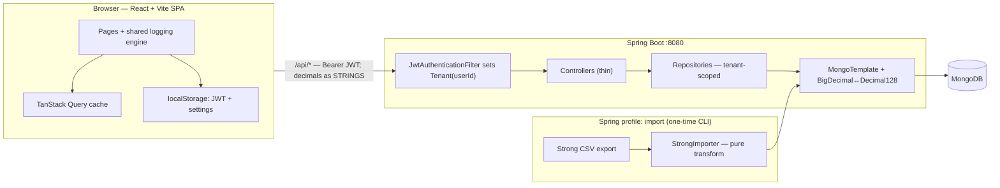

### 2. Data model (collections, embedding & references)

> A **workout session is one document** that embeds `exercises[]`, each embedding `sets[]`. Everything else
> relates by id reference (many-to-many), not joins. Every collection is scoped by `userId`.

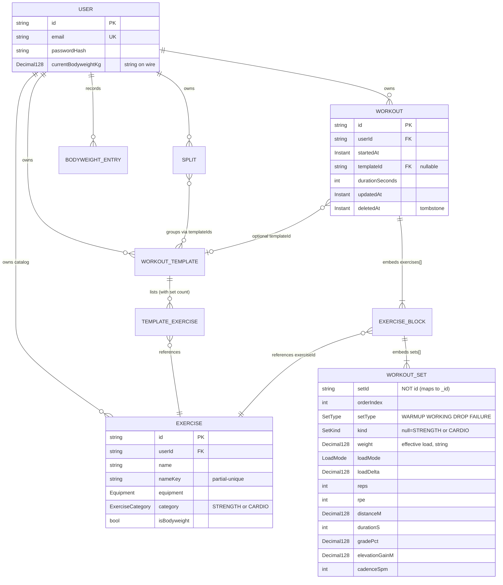

### 3. Backend layers (request path + tenant isolation)

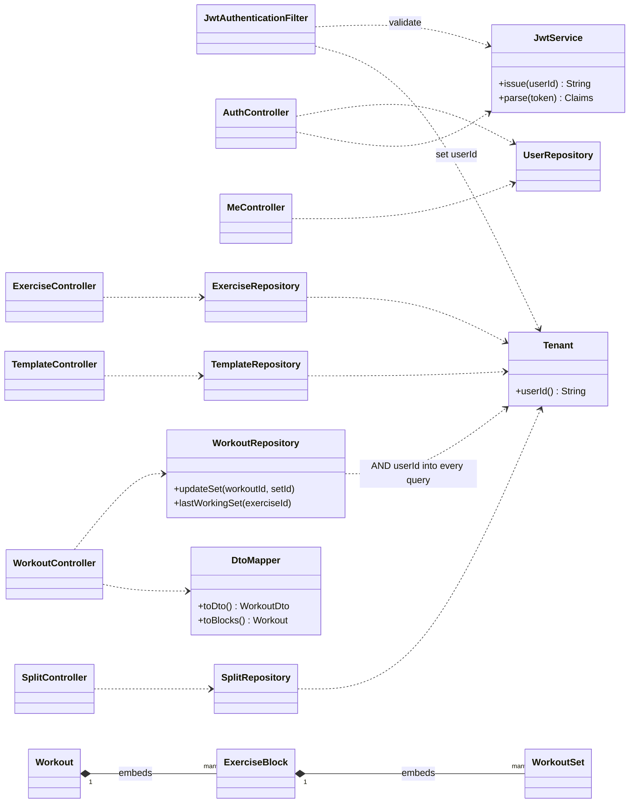

### 4. Frontend modules

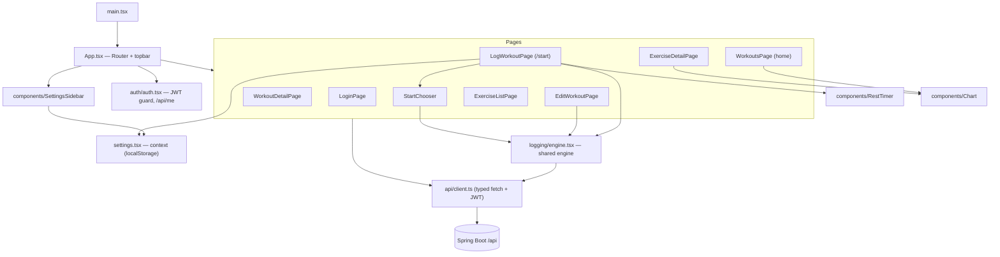

---

## Behavioural

### 5. Authentication & per-request tenant isolation

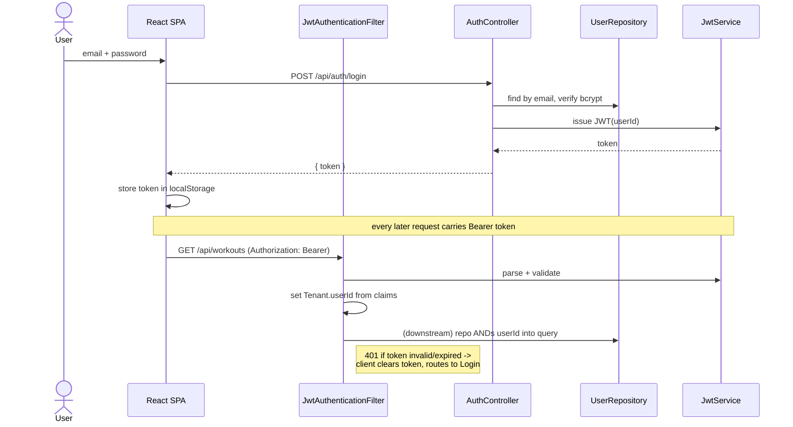

### 6. Logging a workout (start → complete → finish → save)

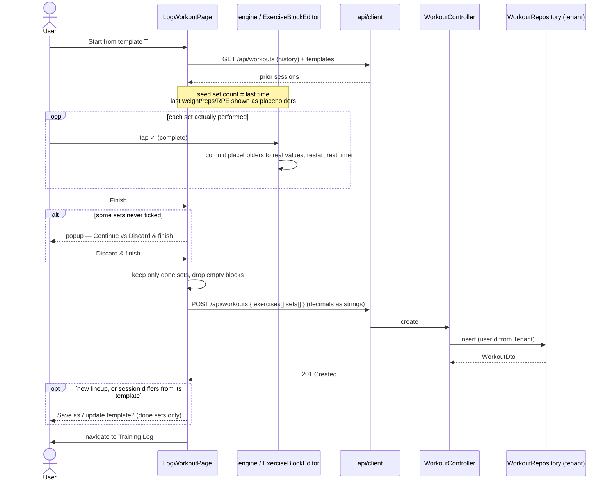

### 7. A set's lifecycle (placeholder → completed → saved/discarded)

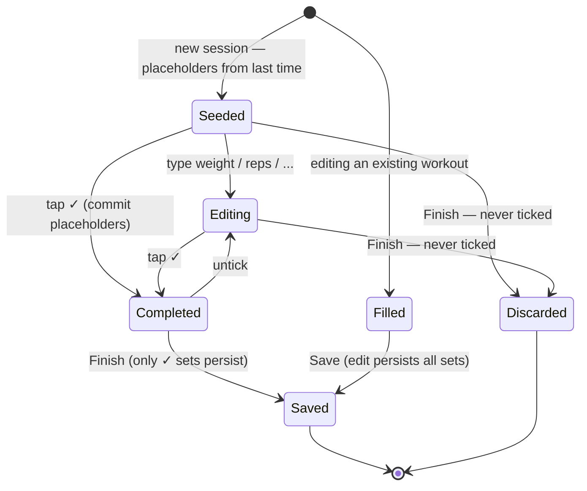

### 8. Finish-workout decision (discarding unfinished sets)

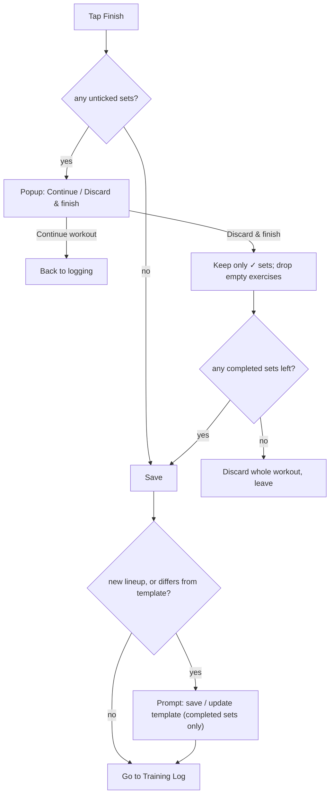

### 9. Editing a completed workout

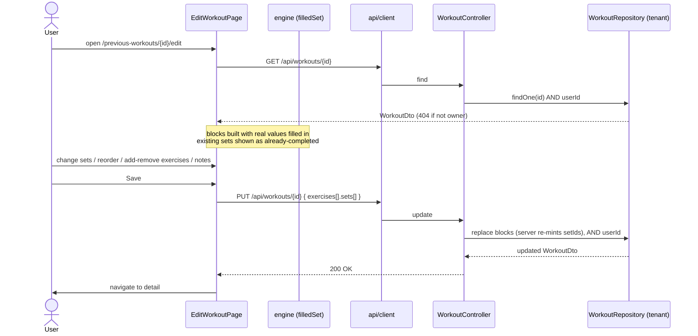

### 10. Macrocycle planner (Layer 4)

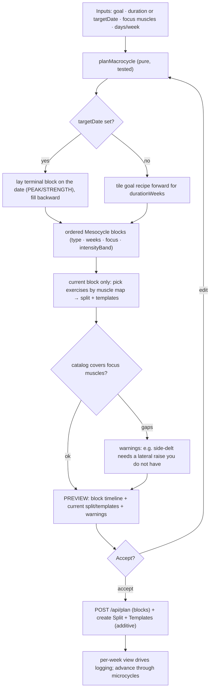

> blockType (volume band + reps) and energy phase (deficit-trim) are orthogonal axes; accept creates, never
> mutates; only the current block's training is materialized — distal blocks stay as intent.

### 11. Prescription, recovery & autoregulation (Layer 5)

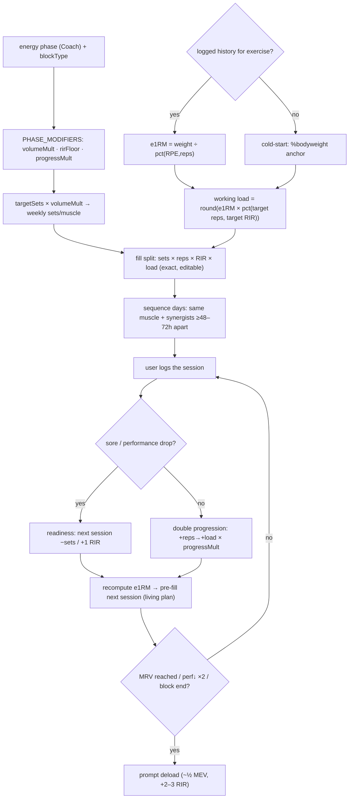

> Energy phase scales volume/intensity/progression; numbers seed from logged e1RM (else %BW cold-start);
> recovery spacing + readiness keep a muscle from being trained fatigued; everything stays an editable preview.
