# Workout Logger — diagrams

Structural and behavioural diagrams (Mermaid, renders on GitHub). 17 validated diagrams. See `DESIGN.md` for the authoritative
architecture record and `CLAUDE.md` for invariants. Diagrams reflect the current code.

---

## Structural

### 1. System architecture (components & runtime)

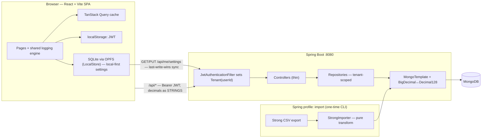

### 2. Data model (collections, embedding & references)

> A **workout session is one document** that embeds `exercises[]`, each embedding `sets[]`. Everything else
> relates by id reference (many-to-many), not joins. Every collection is scoped by `userId`.

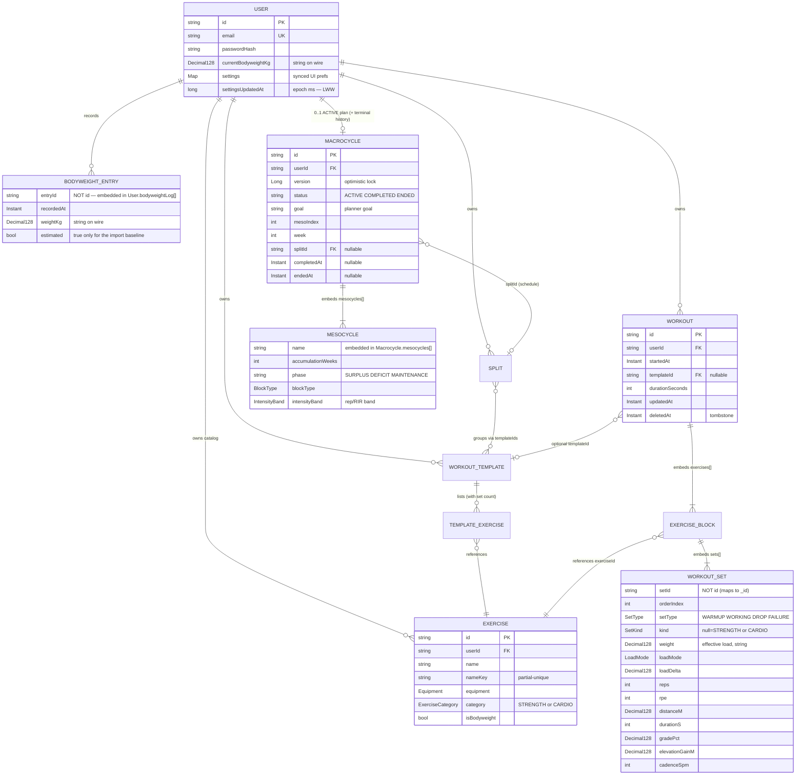

### 3. Backend layers (request path + tenant isolation)

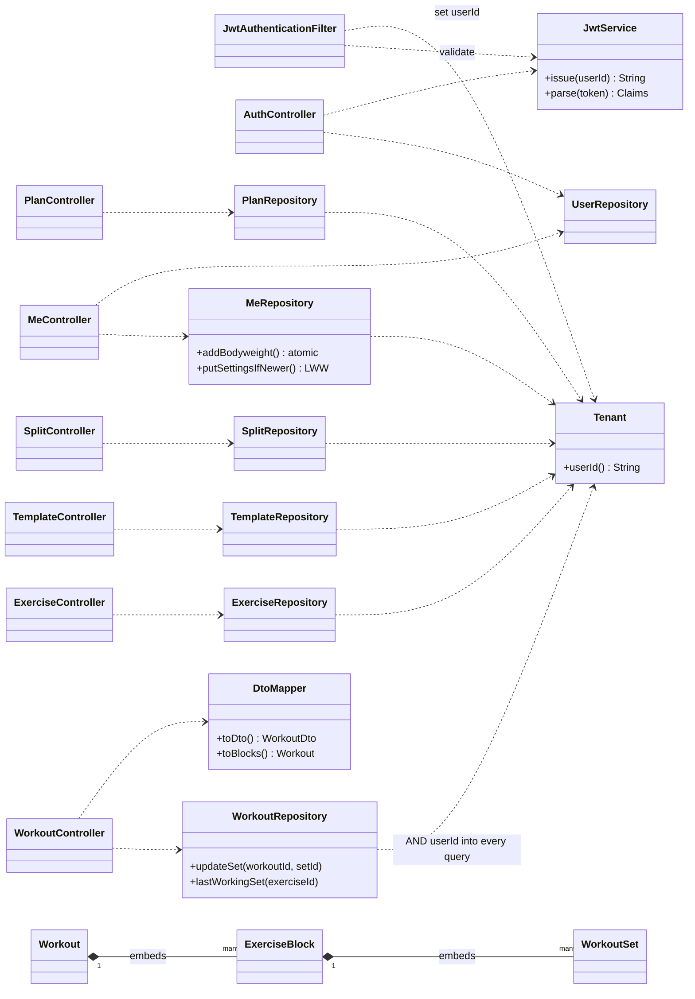

### 4. Frontend modules

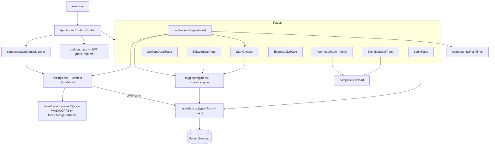

---

## Behavioural

### 5. Authentication & per-request tenant isolation

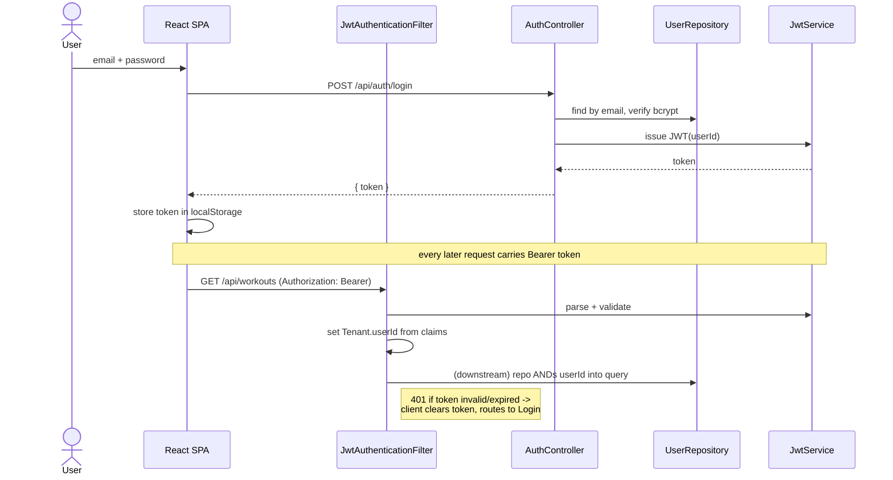

### 6. Logging a workout (start → complete → finish → save)

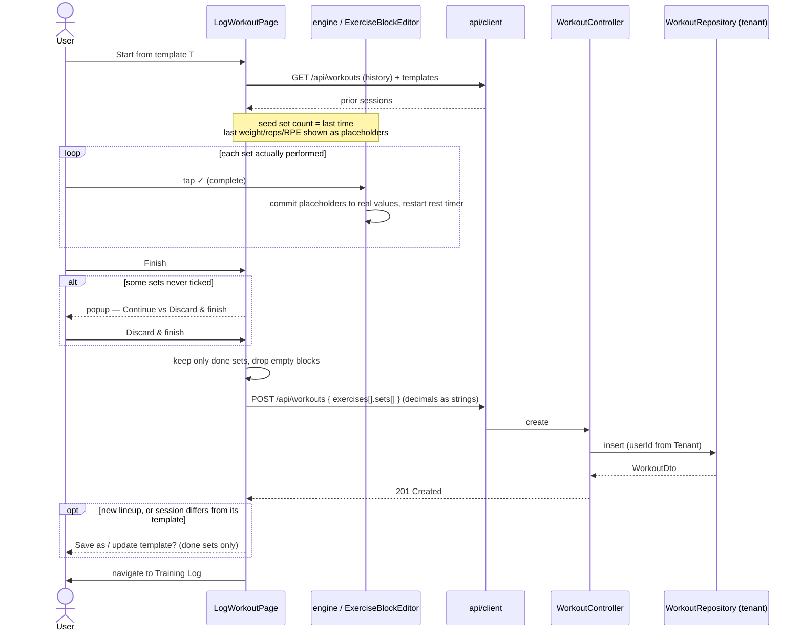

### 7. A set's lifecycle (placeholder → completed → saved/discarded)

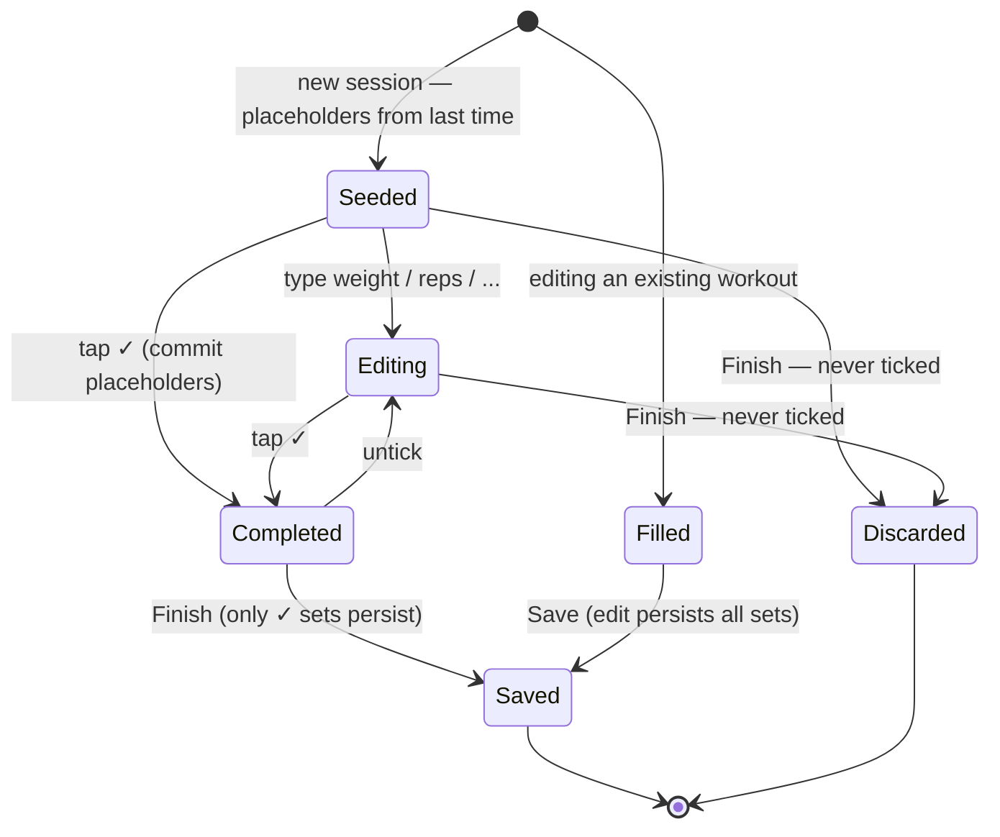

### 8. Finish-workout decision (discarding unfinished sets)

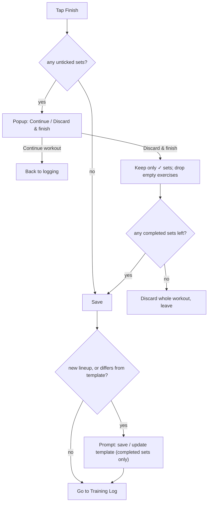

### 9. Editing a completed workout

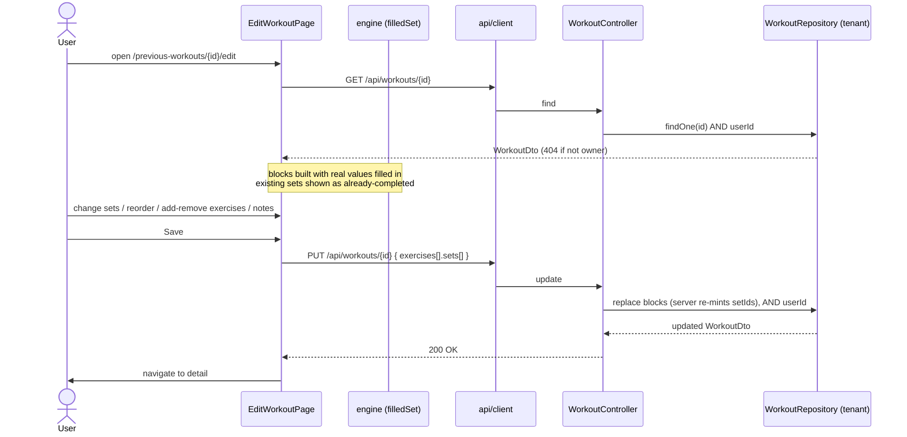

### 10. Macrocycle planner (Layer 4)

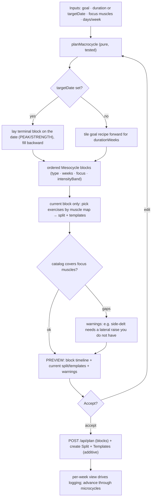

> blockType (volume band + reps) and energy phase (deficit-trim) are orthogonal axes; accept creates, never
> mutates; only the current block's training is materialized — distal blocks stay as intent.

### 11. Prescription, recovery & autoregulation (Layer 5)

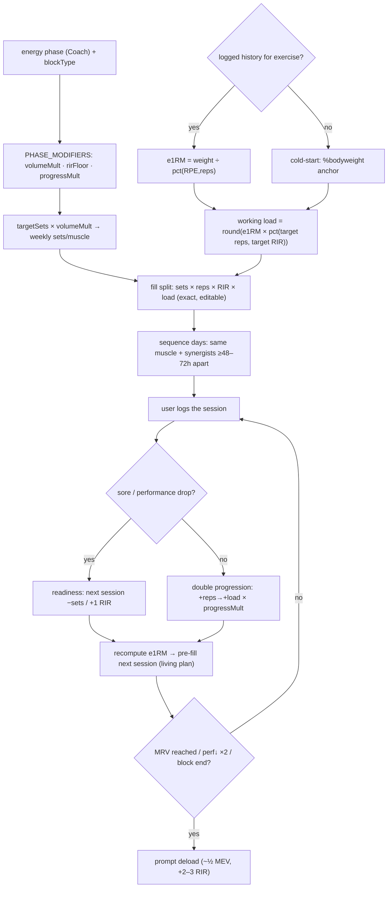

> Energy phase scales volume/intensity/progression; numbers seed from logged e1RM (else %BW cold-start);
> recovery spacing + readiness keep a muscle from being trained fatigued; everything stays an editable preview.

### 12. Domain model — full class diagram (every field, shown as it is STORED)

> Types are the **Mongo storage types**, not the Java types: an `@Id` is an `ObjectId`; a cross-reference
> (`userId`, `templateId`, `exerciseId`, `splitId`) is the plain hex **String**; a weight is `Decimal128`
> (serialized as a **string** on the wire); a timestamp is `ISODate`. Boxes tagged `<<embedded>>` have no
> collection of their own — they live inside their parent document. The six collection roots are tagged with
> their collection name.

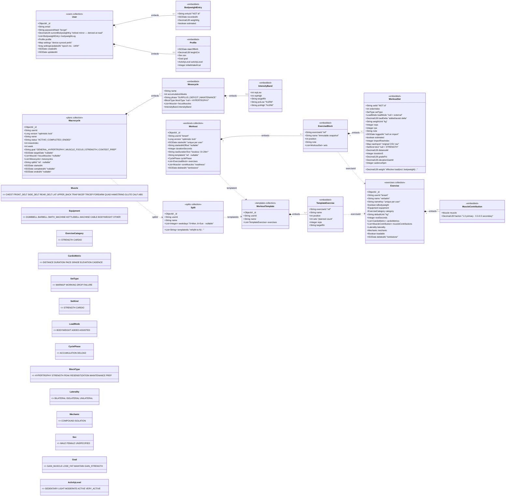

> **Reading it:** solid diamond ◆ = *embedding* (the child is a sub-document of the parent and saved with it);
> dashed arrow ⇢ = *id reference* (a hex-string field resolved in app code — MongoDB does no joins). Every
> collection root carries `userId`, the tenant key ANDed into every query. `Profile.goal` (the `Goal` enum) and
> `Macrocycle.goal` (a String) are **different** vocabularies. Pace/speed are derived from distance/duration and
> never stored. Full field-by-field notes live in `DESIGN.md`.

### 13. Sequence — log a planned session (the living plan)

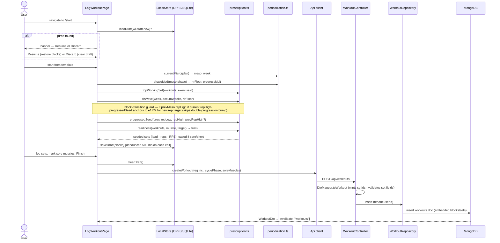

### 14. Sequence — build & accept a macrocycle plan

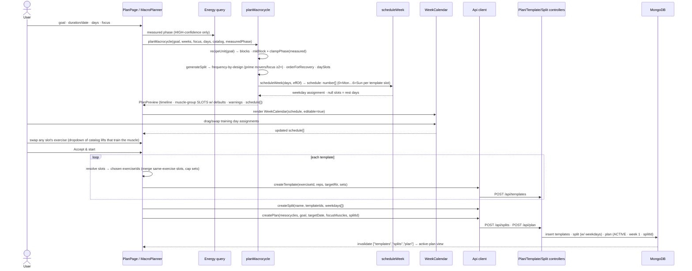

### 15. Sequence — energy "Coach" estimate (read-time, gated)

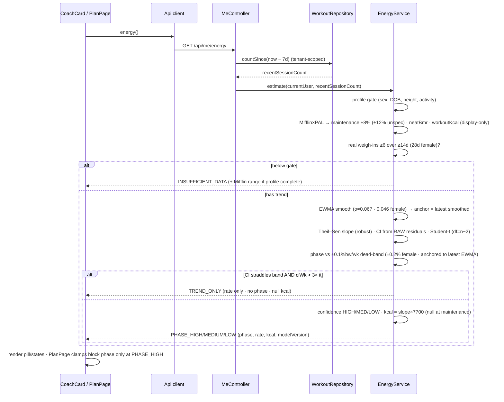

### 16. Sequence — verified sign-up (code) → account + default-catalog seeding

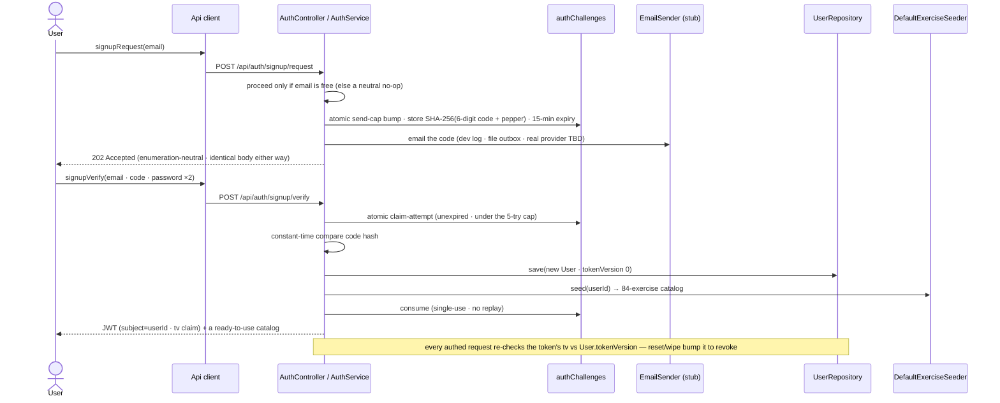

### 17. Sequence — plan completion + history

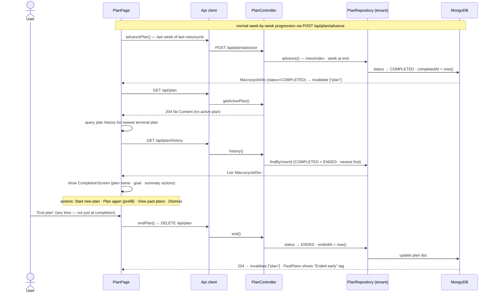
