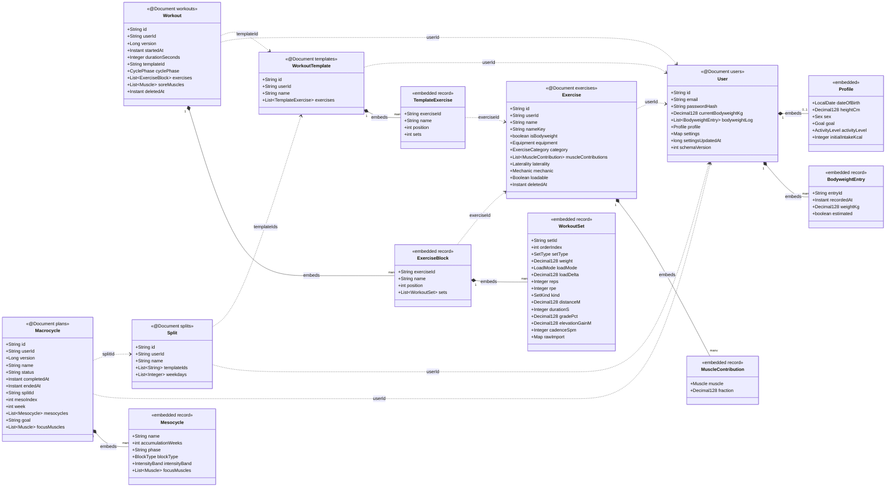

# Database situation — audit, current model & remediation

_Created 2026-07-07. Investigates the "test runs keep spawning databases / the `import@giftnote.com`
account is gone" report, records the current persistence model as a class diagram, and lays out the
fix. This is the input to any "does the DB need remodelling?" call._

## TL;DR

- It is **not** spawning clusters. There is **one** Atlas cluster (`cluster0.s1wclyw…`). What is
  actually happening: **every test/smoke run picks its own ad-hoc _database name_ on that one cluster
  and never drops it**, so leaked `workoutlogger_*` databases have piled up (16 databases total).
- **`import@giftnote.com` no longer exists in any of the 16 databases** — nor does the documented
  24-week demo account `tester@workoutlogger.com`. They were one-time bootstraps into databases that
  were later wiped/recreated, so they are **gone, not hiding**. Recovering them means re-running the
  Strong importer (needs the git-ignored `strong_workouts.csv` + a chosen password).
- **The document schema does not need remodelling to fix this.** The model is sound and well-tested.
  What needs fixing is **environment / database-lifecycle discipline**: dev vs test vs prod
  separation, test teardown, and a reproducible seed for the demo account.

## What is actually happening (the mechanism)

The app connects to whatever `MONGODB_URI` names (default `…/workoutlogger`). Integration tests default
to `…/workoutlogger_test` (`MONGODB_TEST_URI`). Over the project's life, individual sessions ran
audits, smokes and integration passes each against a **deliberately-isolated, hand-named database** on
the same cluster (`workoutlogger_conctest`, `_hardentest`, `_e2e`, `_livesmoke`, …) to avoid clobbering
each other — good instinct, but **nothing ever tears them down**. They accumulate. The single shared
Atlas user/credential means dev data, test data and the "real" demo data all live side by side with no
guard rail; whenever `workoutlogger` itself got re-imported into a fresh name or wiped, the loginable
demo accounts vanished with it.

So the two symptoms are one root cause: **no separation between throwaway test databases and the
canonical dev/demo database, and no lifecycle for either.**

## Database inventory (Atlas cluster, 2026-07-07)

| Database | Size | Users found | What it is |
|---|---|---|---|
| `workoutlogger` | 1.0 MB | `probe-resurface@example.com`, `runskill-2026@example.com` | **active dev DB** — near-empty, no demo data |
| `workoutlogger_e2e` | 1.5 MB | **67** `e2e+…@example.com` | Playwright leaks — never cleaned |
| `workoutlogger_conctest` | 0.7 MB | **34** (`race-…`×23 dupes, `a-/b-/victim-/adv-…`) | C1 TOCTOU audit residue |
| `workoutlogger_hardentest` | 3.2 MB | `wa@`, `wb@` | hardening smoke |
| `workoutlogger_m3test` | 3.0 MB | `noif@example.com` | M3 audit |
| `workoutlogger_deploytest` | 2.2 MB | `wa@`, `wb@` | deploy smoke |
| `workoutlogger_ratelimittest` | 2.0 MB | `wa@`, `wb@` | rate-limit test |
| `workoutlogger_audittest3` | 1.9 MB | `wa@`, `wb@` | audit |
| `workoutlogger_test` | 1.1 MB | `wa@`, `wb@` | default integration-test DB |
| `workoutlogger_updatesettest` | 0.8 MB | `ta@`, `tb@` | set-update test |
| `workoutlogger_cardiotest` | 0.8 MB | `planmulti@example.com` | cardio test |
| `workoutlogger_audittest` | 0.3 MB | `race@example.com`×10 | audit |
| `workoutlogger_audittest2` | 0.4 MB | `race@example.com` | audit |
| `workoutlogger_livesmoke` | 0.3 MB | `livefix@test.com`, `liveplan@test.com` | live smoke |
| `admin`, `local` | 0 | — | Atlas system DBs (leave alone) |

Every `workoutlogger_*` database holds **only synthetic test accounts**. No real/demo data would be
lost by dropping the 13 test databases — but that is a destructive, irreversible op, so it needs an
explicit go-ahead (see Remediation).

## Current persistence model (class diagram)

Six MongoDB collections, one `@Document` aggregate root each. Sessions embed their exercises and sets
(load/save a whole session atomically); cross-aggregate links are **id references, not joins**. Money
values (weight, loads, distances, fractions) are `BigDecimal` in Java ⇄ **`Decimal128` in Mongo,
serialized as strings on the wire** — never JSON numbers.

Standing invariants baked into the model (see `DESIGN.md`): every query ANDs in `userId` (tenant
isolation is the whole security story); embedded ids are `setId`/`entryId`, never `id` (Spring maps a
nested `id`→`_id`); `@Version` optimistic locks on `Workout` and `Macrocycle`; `Workout.deletedAt` /
`Exercise.deletedAt` are soft-delete tombstones.

## Does the database need remodelling?

**The schema: no.** Nothing in the report points at a modelling defect. The stray databases and the
missing account are lifecycle/environment problems; re-shaping documents would not touch them. Forcing
a remodel here would be solving the wrong problem.

Genuine schema-level items already tracked elsewhere (not caused by this, don't block the fix):
- The `@Version` backfill trap if optimistic locking is ever extended to `Exercise`/`Template`/`Split`
  (sync-architecture council, PROGRESS "Pending decisions").
- `rawImport` embeds raw Strong PII — entangled with the GDPR hard-delete-vs-tombstone decision.
- O(n) client-side full-list scans (`pickPrevSets`/`topWorkingSet`) — a read-pattern/index concern for
  the prod-readiness backlog, not a document-shape concern.

**The environment: yes — this is the actual fix.**

1. **Separate databases by purpose, one lever.** Reserve `workoutlogger` for dev/demo; give tests a
   disposable namespace (a per-run suffix, or a throwaway `workoutlogger_ci` that is dropped at the end
   of the run). Longer term, a separate cluster (or at least a separate DB user) for prod.
2. **Tests must clean up after themselves.** Integration/e2e suites should drop (or `deleteMany` +
   drop-on-teardown) their database at the end, so `_e2e`'s 67-and-counting users can't recur. CI's
   `mongo:7` service container already gets this for free; the leak is only from **Atlas** runs.
3. **A reproducible demo seed.** The reason losing a database hurts is that the demo account only ever
   existed via a **manual, one-time** import of a git-ignored CSV. Make re-seeding a scripted,
   idempotent step (importer already is a pure deterministic transform) so `import@giftnote.com` (or a
   renamed canonical demo account) can be rebuilt on demand — password chosen at seed time, never
   committed.
4. **Cleanup (destructive — needs explicit approval).** Drop the 13 leaked `workoutlogger_*` test
   databases. All contain only synthetic accounts (table above), but it is irreversible, so it does not
   happen without a go-ahead.

## Open calls for Avishek

- **Recreate the demo account?** If yes: confirm the email (`import@giftnote.com` vs a new one) and
  supply/choose a password; I re-run the importer against `workoutlogger` (needs `strong_workouts.csv`).
- **Drop the 13 stray test databases now?** (Synthetic data only; irreversible.)
- **Test-DB strategy:** per-run suffix + teardown vs a single dropped `workoutlogger_ci` — either kills
  the leak; pick one and I'll wire it into the test config + CI.
- The single shared Atlas credential is part of why dev/test/prod data mingles; a per-environment,
  least-privilege user would separate them properly.
